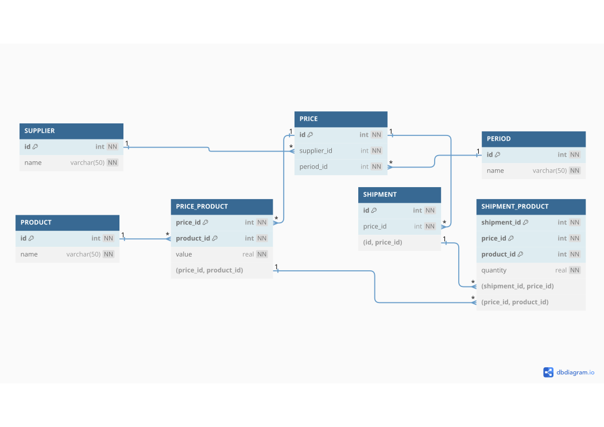

Сервис учёта поставок для Северной Фруктовой Компании
=====================================================

### Постановка задачи

Имеется 3 поставщика, каждый из поставщиков может поставлять 2 вида груш и 2 вида яблок. Поставщики заранее сообщают свои цены на виды продукции на определенный период поставок.  

Необходимо:  
 - создать интерфейс приемки поставок от поставщиков. В одной поставке от поставщика может быть несколько видов продукции.   
 - создать отчёт. За выбранный период показать поступление видов продукции по поставщикам с итогами по весу и стоимости.  

Требования:  
Данные приложения должны сохранятся в БД путем формирования таблиц из объектов Backend (PostgreSQL), Backend – Hibernate, Java, Spring Framework. Frontend – любая реализация, достаточно тестовых JSON файлов на каждую API.  

### Описание БД

ER диаграмма находится в файле [db/db-er.pdf](db/db-er.pdf)  
  
БД создаётся из java сущностей. Определены следующие сущности:  
 - *Supplier* - Поставщик  
 - *Product* - Вид продукции  
 - *Period* - Период поставок  
 - *Price* - Прайс лист  
 - *PriceProduct* - Позиция в прайс листе  
 - *Shipment* - Поставка  
 - *ShipmentProduct* - Позиция в поставке

### Контроллеры 

 - *SupplierController* - */supplier* - Операции с поставщиками  
 - *ProductController* - */product* - Операции с видами продукции  
 - *PeriodController* - */period* - Операции с периодами
 - *PriceController* - */price* - Операции с прайс листами
 - *ShipmentController* - */shipment* - Операции с поставками
 
### Запуск сервиса и настройка

```
java -jar supplier-service.jar
```
По умолчанию при каждом запуске сервиса таблицы БД создаются заново в схеме *sevfruit*.  

Настроечные параметры:  

```
spring.datasource.url=jdbc:postgresql://localhost:5432/training
spring.datasource.username=sevfruituser
spring.datasource.password=password
spring.jpa.properties.hibernate.default_schema=sevfruit
server.error.include-message=always
app.db.init.enabled=false
spring.jpa.hibernate.ddl-auto=create
spring.sql.init.mode=always
```
Пользователь БД должен иметь разрещение *CREATE* для заданной в URL БД: `GRANT CREATE ON DATABASE training TO sevfruituser;`  

За заполнение начальными данными отвечает параметр *app.db.init.enabled*  
Запуск сервиса с заполнением БД начальными данными: `java -Dapp.db.init.enabled=true -jar supplier-service.jar`  


### Ссылки

[https://dbdiagram.io/d](https://dbdiagram.io/d)  
